# DWP HW4

### 遊戲流程&畫面
1. 遊戲主頁
   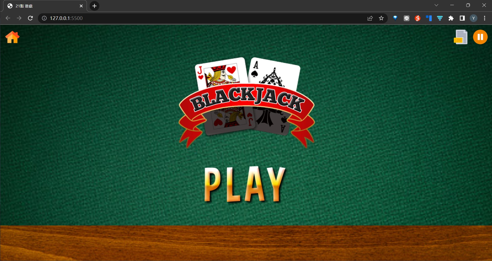
   點選PLAY開始遊戲

2. 下注畫面
   
   注意預設時間為10秒，若10秒倒數完玩家未按下 「DEAL」則自動幫玩家下注目前已丟出的籌碼(若無丟出任何籌碼則自動下注100)

   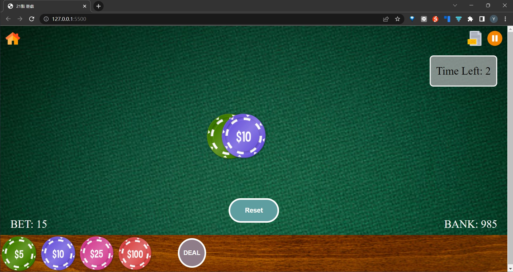
   點選不同籌碼增加賭注，可點選「Reset」 重新下注

3. 遊戲階段
   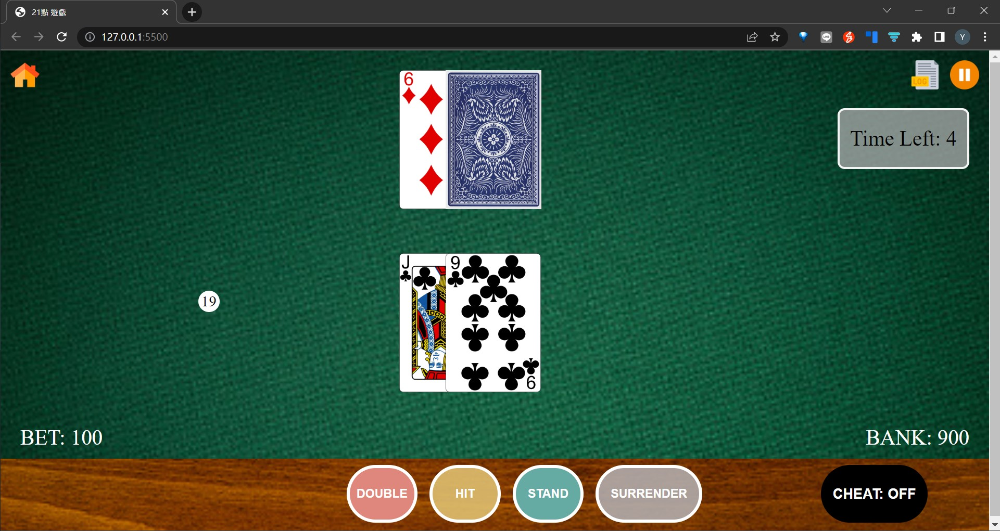
   遊戲開始，莊家及玩家抽牌，玩家可以選擇自己想執行的動作(Split、Double、Hit、Stand)，若倒數10秒結束玩家未執行動作，則自動幫玩家執行「STAND」

4. 顯示遊戲結果
   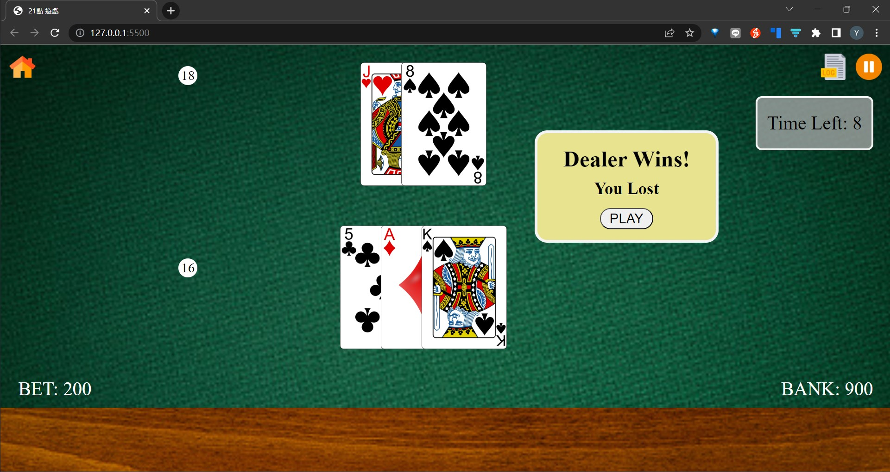
    公布遊戲結果

## 功能介紹

### 查看Log
- 玩家可隨時點選頂部工具列中的「LOG」圖示，開啟Log面板(倒數計時功能自動暫停)
- 左方為以SessionStorage儲存的Game Log，詳細紀錄遊戲中的每個event
- 右方為以LocalStorage儲存的Game History，紀錄每一局遊戲的結果
- Game History 可以以三種模式 Sort
   - Game ID
   - Chip
   - Time
  
如下圖:
1. Sort by Game ID
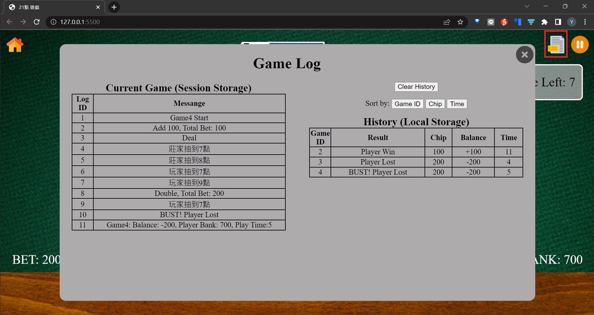

2. Sort by Chip
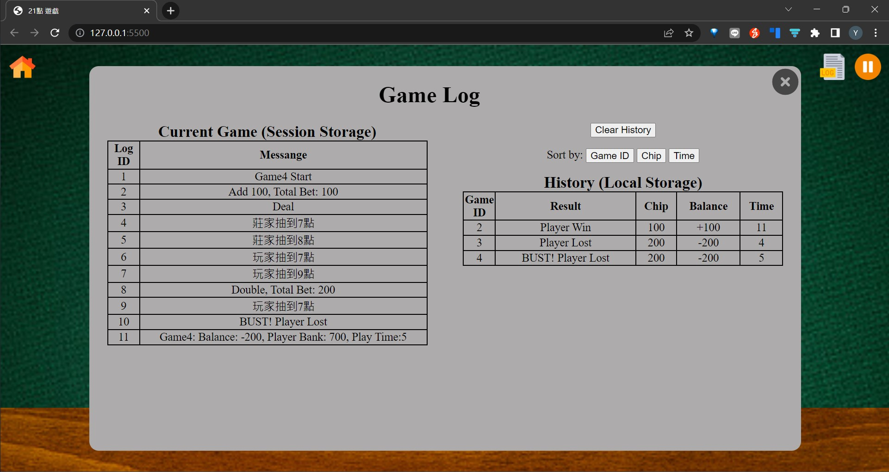

3. Sort by Time

### 暫停
玩家可隨時點選頂部工作列的暫停/繼續圖示，將導數計時暫停/繼續
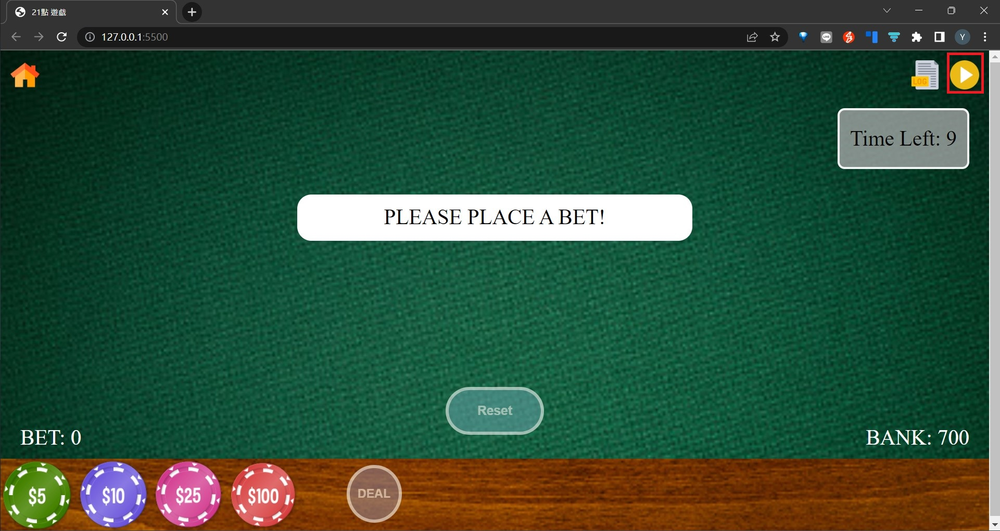

### Cheat
可以點選底部選單的「CHEAT」開啟/關閉作弊模式(讓玩家高機率點數超過21點)

- Cheat關閉(button內文字提示CHEAT:OFF)
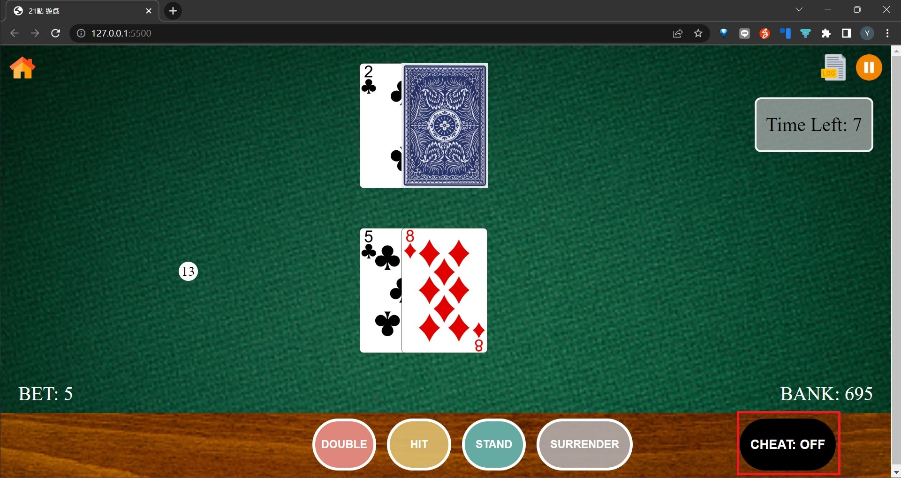

- Cheat開啟(button內文字提示CHEAT:ON)
- 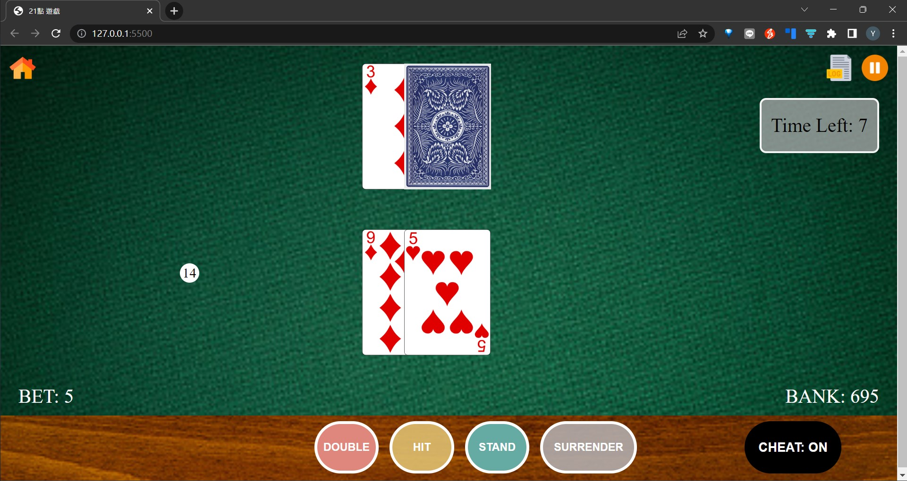

### 回主畫面
玩家點選頂部工具列「回主畫面」圖示，可回到主畫面，不過若遊戲玩到一半該局直接算輸
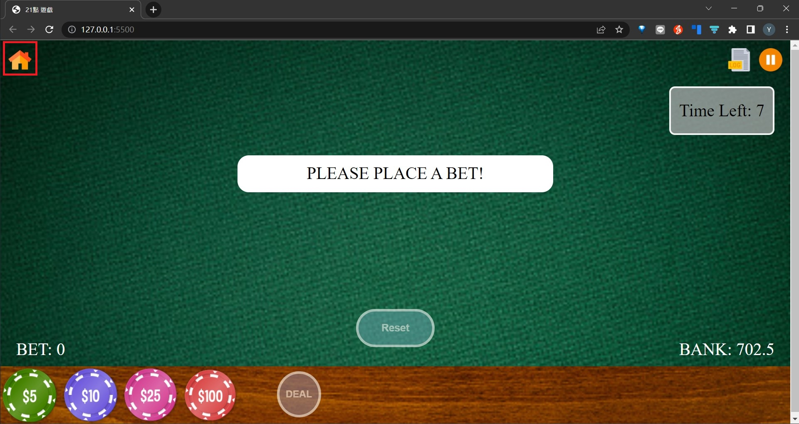

### 廣告
玩家每玩完一場遊戲，進入新的一局時會自動跳出隨機的廣告(隨機3張廣告)
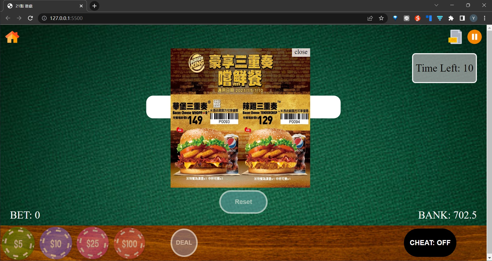